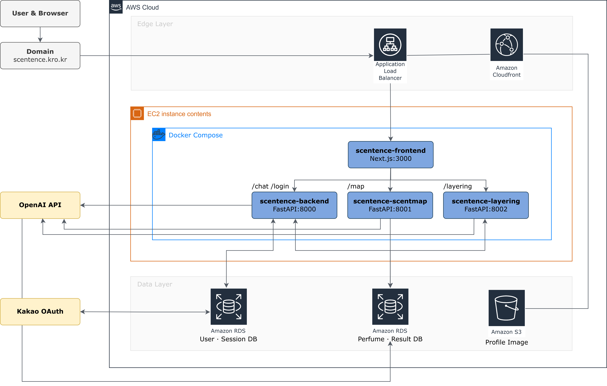
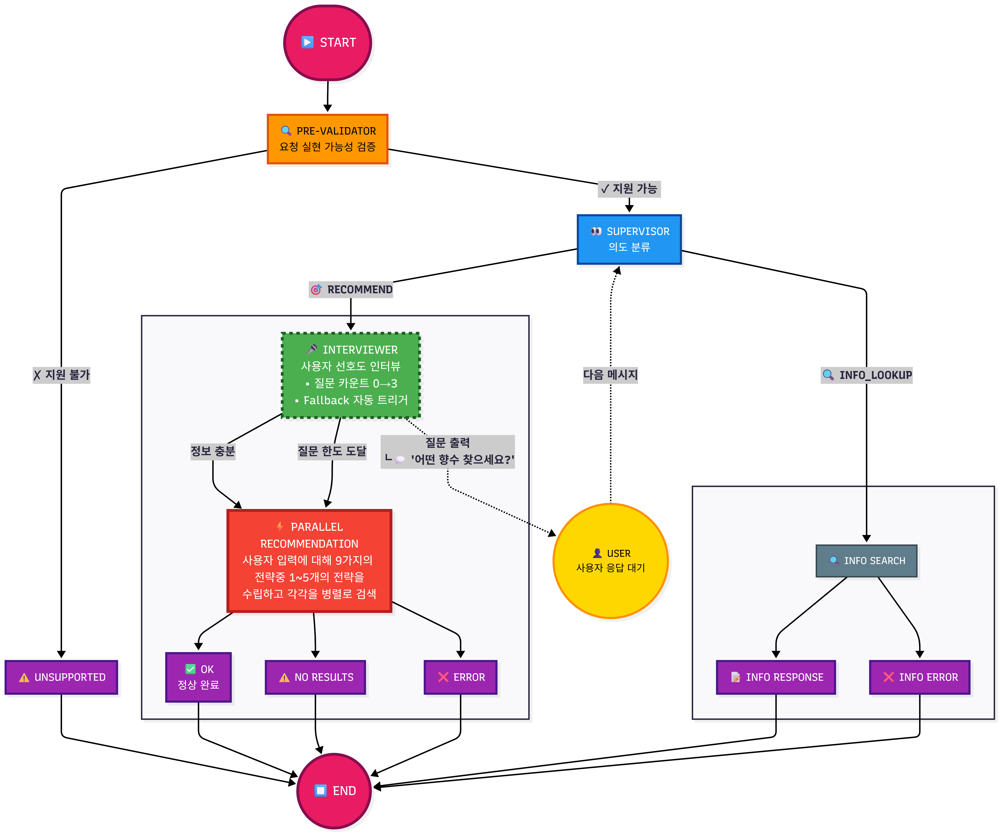

# SCENTENCE

 **향수 선택의 어려움을 해결하는 LLM 기반 대화형 향수 추천 플랫폼**

---

## 목차
1. [팀 소개](#팀-소개)
2. [프로젝트 개요](#프로젝트-개요)
3. [기술 스택](#기술-스택)
4. [문제 정의](#문제-정의)
5. [문제 해결 전략](#문제-해결-전략)
6. [수집 데이터 및 활용 목적](#수집-데이터-및-활용-목적)
7. [시스템 아키텍처](#시스템-아키텍처)
8. [성과 및 검증](#성과-및-검증)
9. [트러블 슈팅](#트러블-슈팅)
10. [향후 계획](#향후-계획)
11. [회고](#회고)
12. [문서](#문서)

---

## 팀 5S

| 이름 | 역할 | 깃허브 링크 |
|------|------|------|
| **신지섭** | PM / Agent / Backend | [@Melonmacaron](https://github.com/Melonmacaron) |
| **이상민** | Data / Backend | [@ChocolateStrawberryYumYum](https://github.com/ChocolateStrawberryYumYum) |
| **김소희** | Data / Frontend | [@sosodoit](https://github.com/sosodoit) |
| **마한성** | Data / Backend | [@gitsgetit](https://github.com/gitsgetit) |
| **김성욱** | Data / Frontend | [@souluk319](https://github.com/souluk319) |

---

## 프로젝트 개요

### 프로젝트 주제
LLM 기반 대화형 향수 추천 플랫폼

### 타겟 대상

향수에 관심 있는 입문자

### 핵심 가치

AI 기반 개인화된 향수 큐레이션

### 주제 선정 배경
- **데이터 풍부**: 향수는 노트와 리뷰 데이터가 풍부하여 LLM에 적합한 도메인
- **추상적 표현**: 개인의 추상적인 취향을 자연어로 표현하는 특성
- **개인화 트렌드**: 개성을 표현할 수 있는 향수에 대한 관심 증가
- **추천 방식 전환**: 키워드 검색 중심 → 대화형 추천 구조

### 서비스 목적
- **입문자**: 맞춤형 향수 추천과 기본적인 향수 백과 정보 제공
- **숙련자**: 심화된 레이어링 추천과 향수 지도 기능을 통한 심도 있는 향수 경험 제공

---

## 기술 스택

**Frontend**
- Next.js

**Backend**
- FastAPI (Python)

**AI/ML**
- OpenAI API
- text-embedding-small (임베딩)

**Database**
- Amazon RDS (MySQL/PostgreSQL)
- Amazon S3 (이미지 저장)

**Infrastructure**
- AWS EC2
- Docker Compose
- Application Load Balancer
- Amazon Cloudfront

**Authentication**
- Kakao OAuth

---

## 문제 정의

### 핵심 Pain Point

| 유형 | 문제점 |
|------|--------|
| **언어적 장벽** | 일상적 표현과 향료 전문 용어 간 간극 / 선호 향을 명확히 설명하기 어려움 |
| **정보의 파편화** | 분산된 정보 탐색 부담 증가 / 구매 의사결정 과정의 비효율화 |
| **정보의 과부하** | 시장 내 향수 제품 수 과다 / 개인 취향에 맞는 선택의 어려움 |

### 기존 서비스 한계
- **정보 입력 방식**: 정형화된 선택으로 추천받기 위한 정보 입력에 제약
- **결과 제공 방식**: 추천된 향수의 기본적 정보만 제공, 전문 용어 사용
- **개인화 수준**: 사용자의 상황이나 취향 정보를 고려하지 않음

### 주요 문제점 상세

| 번호 | 문제점 | 해결 방향 |
|:---:|---|---|
| 1 | **일상 언어와 향료 정보 간 연결 체계 부족** | 향 언어 표현 사전 구축 |
| 2 | **사용자의 추상적 향 표현을 데이터로 변환하지 못함** | 향 해석 구조 설계 |
| 3 | **개인 맥락을 반영한 추천 부족** | 개인화 추천 구조 설계 |

---

## 문제 해결 전략

### AI 기반 대화형 추천

**핵심 엔진: Multi-Agent 방식**
- 패러다임 전환: 취향을 **입력받는 추천** → **해석하는 추천**으로
- 에이전트 역할을 계층적으로 구분하여 설명가능한 추천 제공
- **향 표현 사전 활용**: 새롭게 생성한 향 표현 사전을 활용하여 일상 용어로 답변 생성

**향수 도메인 특화 AI의 강점**
- 향 구조 기반 해석
- 감각 언어 → 향 데이터 매핑
- 대화를 통해 수집된 정보 기반으로 추천

### 확장 서비스 (Experience Layer)

| 서비스 | 설명 | 기능 |
|--------|------|------|
| **레이어링 서비스** | 초개인화 - 정의한 향수 위에 다른 향수를 덧붙이는 행위 | 기술 어코드 정보 기반 계산, 효과 레이어링하기 좋은 향수 추천 |
| **향수 지도** | 잠재적 취향 탐색, 보유/관심 향수 시각적 확인 | 시각화된 직관적인 향수 분포 파악, 새로운 취향 발견 기회 |
| **향수 옷장** | 개인화 데이터 축적 | 연동 추천 시스템과 연계, 개인화 추천 반영 |

---

## 수집 데이터 및 활용 목적

| 데이터 | 개수 | 출처 | 목적 |
|--------|------|------|------|
| 향수 리뷰 데이터 | 4,184개 | Parfumo | 정확한 향수 정보 제공 |
| 노트-설명 임베딩 데이터 | 2,042개 | 자체 제작 | 추상적 요청과 전략에 적절한 노트 선정 |
| 향수 정보 데이터 | 160,770개 | Parfumo & Fragrantica | 리뷰 데이터를 통한 리랭킹으로 사용자 요청 반영 |
| 노트/어코드 사전 | 71개 | 자체 제작 | 검색된 향수의 노트와 어코드에 대해 사용자 친화적 설명 |

---

## 시스템 아키텍처

### 전체 시스템 구조

### 추천 시스템 구조

---

## 성과 및 검증

### 정성적 검증: 시나리오 테스트

| 시나리오 유형 | 성공률 |
|-------------|--------|
| 오타 입력 | **100%** |
| 부정적인 피드백 | **75%** |
| 피드백 | **50%** |
| 정보가 부족한 질문 | **50%** |
| 예상 밖의 시나리오 | **25%** |
| 재질문 | **100%** |
| 기타 | **63%** |

### 사용자 설문 결과 (5점 만점)

| 항목 | 점수 |
|------|------|
| 개인 취향 반영 | **3.6** / 5.0 |
| 추천 근거에 대한 납득 | **3.7** / 5.0 |
| 설명에 대한 이해도 | **3.8** / 5.0 |
| UI 사용 편의성 | **4.2** / 5.0 |

### 정량적 검증

| 지표 | 결과 | 평가 |
|------|------|------|
| **중복률** | 44.40% | 보통 (30% 이하 목표) |
| **개인화 지수** | **84.37점** | 우수 (목표 83.5+) |

> **개인화 지수 산출**: 브랜드(30%) + 어코드(35%) + 노트(35%) 
> - Shannon Entropy 50% + Simpson Index 50%

### 주요 개선사항
- 정보 부족 상황 대처 로직 구성
- 16만 개 리뷰 데이터 임베딩 활용
- 노트/어코드 사전 제작으로 전문 용어 친화적 설명

---

## 트러블 슈팅

### 향수 그래프 랜더링 지연 문제

그래프 연산을 사전 계산해놓고 사용자들이 많이 사용하는 향수 위주로 로딩하여 사용자 입력에 따라 필요한 부분만 필터링해 렌더링하는 구조로 변경

### 레이어링이 어울리는지 알 수 없는 문제

원본 향수와 추천된 레이어링 향수가 서로 얼마나 어울리는지 알 수 없는 문제가 있어 점수 기반을 통해 얼마나 어울리는지 정량적으로 알 수 있게 표현하도록 개선

---

## 향후 계획

### 단기
- 가격 정보 표시 (공식 사이트 연동)
- 추천 로직 고도화 (정확도 및 정합성 개선)

### 중기
- 위치 정보 표시 (가장 가까운 시향 매장 안내)
- 노트/어코드 사전 확장 (더 많은 향료 정보 추가)

### 장기
- 커뮤니티 활성화 (일상적 언어로 초보자도 쉽게 접근 가능한 자체 커뮤니티 형성)

---

## 회고

| 이름 | 회고 |
|------|------|
| 김성욱 | 이번 프로젝트에서 프론트엔드를 담당했습니다. 가장 중요하게 여긴 부분은 서로 다른 기능(챗봇, 레이어링, 향수 지도, 컬렉션 관리)을 하나의 서비스 경험으로 연결하는 것이었습니다.이를 위해 화면을 사용자 행동 흐름(발견 → 저장 → 다시 꺼내보기) 기준으로 구성하고, 향에 대해 발견하고 수집하는 놀이 공간처럼 느껴지도록 매거진형 랜딩 페이지와 인터랙션 중심 UI로 구현 했습니다.팀원들과 기획 의도를 조율하며 디자인과 구현 사이의 간극을 줄일 수 있었고, 이 과정을 통해 서비스의 성격과 사용 맥락을 프론트엔드 관점에서 깊이 고민해볼 수 있었습니다. |
| 김소희 | 향수 추천을 단순한 결과 제공이 아니라, 향을 이해하고 탐색하는 과정으로 만들고자 하는 목표가 있었습니다. 이를 위해 향수 지도와 향 MBTI 카드를 취향을 단정하는 도구가 아니라, 향 간의 관계와 성향을 드러내 사용자가 스스로 자신의 취향을 해석하도록 돕는 장치로 설계했습니다. 개발 과정에서 이러한 의도는 문서에 머무는 것이 아니라, 화면 구성과 인터랙션을 통해 명확히 드러나야 사용자에게 전달된다는 점을 깨달았습니다. 프로젝트 초기에는 추천 에이전트의 researcher 구조를 설계하며, 사용자 질의에서 키워드를 추출해 내부 향수 DB를 조회하고 리뷰 데이터를 기반으로 추천 사유를 생성하는 흐름을 제안했습니다. 비록 해당 주고를 직접 구현하는 역할은 아니었지만, 설계 관점에서 LLM 기반 추천은 단순한 설계로 시작하여 실제 입력과 출력의 반복을 통해 점진적으로 정교해진다는 점을 몸소 체감했습니다. 이후 전체 구현 결과를 돌아보며, 향수 지도와 레이어링 추천이 하나의 흐름으로 자연스럽게 연결되었다면 향을 탐색하고 조합하는 경험이 더욱 확장될 수 있었을 것이라는 아쉬움도 남았습니다. 그럼에도 이번 프로젝트는 사용자 인터랙션 중심의 향수 추천 플랫폼으로 발전할 수 있는 기반을 마련했다는 점에서 의미가 있었으며, 서비스 배포를 직접 경험하며 AWS 인프라와 실서비스 운영 관점의 고려사항을 체득한 점이 가장 큰 수확이었습니다. |
| 마한성 | 이번 프로젝트에서 데이터 수집과 레이어링 기능을 전담하며 서비스의 기반 데이터와 레이어링 추천 로직을 구축했습니다. 상품명 전처리를 통해 통합 DB를 구축하고, 어코드 기반 벡터 연산으로 수학적인 레이어링 조합을 구현했습니다. 다만 데이터 수집 채널의 한계로 인해 추천의 다양성이 부족했던 점이 아쉬움으로 남아, 향후에는 더 폭넓은 데이터를 확보하고 로직을 고도화하여 한층 정교한 개인화 추천 서비스를 완성하고 싶습니다. |
| 신지섭 | "이번 프로젝트는 추천 에이전트의 설계와 구현을 담당했습니다. 프로젝트 초기 평가 지표 설정을 통해 개발 효율성을 확보했지만, 동시에 '지표'와 '목표' 사이의 괴리를 확인하는 계기가 되었습니다. 초기 기획 단계에서 목표가 모호하면 아무리 좋은 지표도 무용지물임을 배운 만큼, 향후에는 목표 설정을 구체화하여 평가지표에 온전히 녹여내는 설계를 해나갈 것입니다." |
| 이상민 | 주제 선정 단계에서 주제가 '향수'로 정해졌을 때는 걱정도 많이 되었지만 기획 단계에서 향기를 문장으로 표현한다는 점이 흥미로워서 점차 관심을 갖게 되었습니다. 이번 프로젝트에서 제가 맡았던 역할은 프론트-백이었는데, 전체 프로젝트를 유기적으로 이어주고 직접적으로 사용자가 보고 느낄 수 있는 부분이라 더 열심히 하게 된 것 같습니다. 이외에도 데이터 전처리/임베딩 및 적재도 진행해보고 DB 엔지니어 분야에도 흥미를 갖게 되었습니다. 팀 프로젝트가 끝나긴 했지만, 2개월이라는 시간적 제약도 있었고, 에이전트 설계도 도전해보고 싶어서 개인적으로 프로젝트를 이어가보려고 합니다. 끝으로 지금까지 함께한 SKN 부트캠프 여러분, 6개월 동안 수고많으셨고 앞으로 멋진 행보를 응원하겠습니다. |
